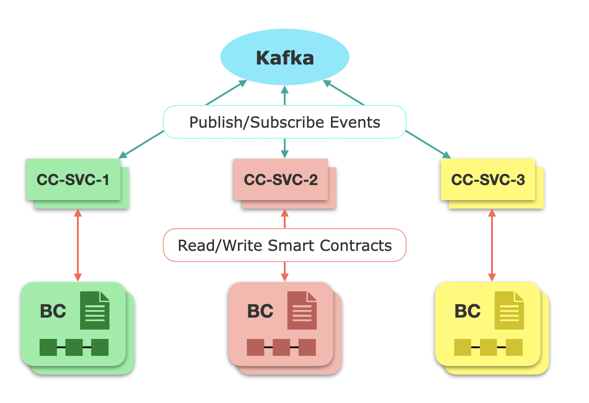

# PIEChain

We develop a general cross-chain communication framework that uses the Kafka protocol for secure interaction.



### Entities
* The Kafka network provider, who maintains the Kafka network.
* Developers, who develops cross-chain services (CC-SVCs) using an event-
driven approach.
* End users, who deploy smart contracts and use the CC-SVCs for cross- chain operations.

### Usage

Register event handlers for different services.
```go
ccsvc, err = cclib.NewEventService(
	[]string{"zoolkeeper_nodes"},
	"service_name",
)
check(err)
// register event handlers
ccsvc.Register("event_1", handleEvent1) 
ccsvc.Register("event_2", handleEvent2)
err = ccsvc.Start() // start service
check(err)
```

Publish events with corresponding payloads
```go
b, _ := json.Marshal(Event1Body{
	Hash: hash,
	// ...
})
ccsvc.Publish("event_1", b)
```

### Example Applications

#### Flash Loan 
[Demo](https://drive.google.com/file/d/1dBHgUrdAmx1COR_3nYZLI5uPjbjk2Sks/view?usp=sharing)

You can run the cross-chain flash loan demo by the following steps.

1. Make sure you have both ethereum and fabric 2 running on the machine.

2. Deploy `contracts/fabric_erc20` with name `token1` on fabric

3. Compile each folder inside `examples/flashloan` using `go build .`

4. Run `cclender` and `ccrbit` in two different terminals.
They are the cross-chain exchange services responsible for relaying messages between two blockchains.
```bash
# from cclender directory
./cclender

# from ccarbit directory
./cclender
```

5. Setup `tokens` and `amm` exchanges using `cli`
```bash
# from cli directory
./cli -c setup
```

6. Setup flashloan contracts `lender` on `fabric` and `arbitrage` on `ethereum`.
```bash
# deploy contracts/fabric_lender on fabric

# from arbitrageur directory
./arbitrageur -c setup
./arbitrageur -c register
```
You can check the results in `flash_loan.json` and `commit_vote.json`.

7. Sign Commit Vote by `lender`.
```bash
# from lender directory
./lender -c sign
```

8. Initialize flash-loan with commit vote by `lender`.
```bash
# from lender directory
./lender -c initialize
```
After this step, cross-chain services will detect lender initialization on `fabric` and transfer loan to `arbitrage` contract on `ethereum`.

9. Execute `arbitrage` by `arbitrageur`.
```bash
./arbitrageur -c execute
```
If `execute` is successful, the `arbitrage` contract will transfer `loan + intrest` to the cross-chain exchange and the cross-chain services will transfer `loan + intrest` to the lender.
if `execute` is failed, the `lender` will still get refund of initial `loan` on fabric.

You can check the token balances on both blockchains using this command.
```bash
# from cli directory
./cli -c display
```

#### Auction 
[Demo](https://drive.google.com/file/d/16f1X0UOpoHOm3NqUJa_K66PA0JtSMzYq/view?usp=sharing)

You can run the auction example by the following steps.
1. Make sure you have three blockchains ethereum, quorum and fabric running on the machine.

2. Deploy `contracts/fabric_asset` on `fabric`.

3. Run `relayer` and `signer` cross-chain services.
```bash
# from examples/auction/relayer
./relayer 
# from examples/auction/signer run signers with different keys for multiple instances (at least 2 for each auction blockchain)
./signer -p ethereum -id 1 -key ../../keys/key1
./signer -p quorum -id 1 -key ../../keys/key5
```

3. Run the `scenario` script.
```bash
# from examples/auction/scenario
go run .
```
This script will do the following steps.
1. Add a new asset on the fabric `asset` contract.
3. Deploy auction contracts on `ethereum` and `quorum`.
2. Create a new auction for this asset on on fabric.
3. Bid correspondingly on both `ethereum` and `quorum`.
4. End auction on `fabric` and print out the winner info and final asset owner on `fabric`.

